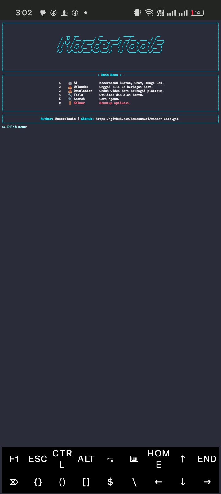
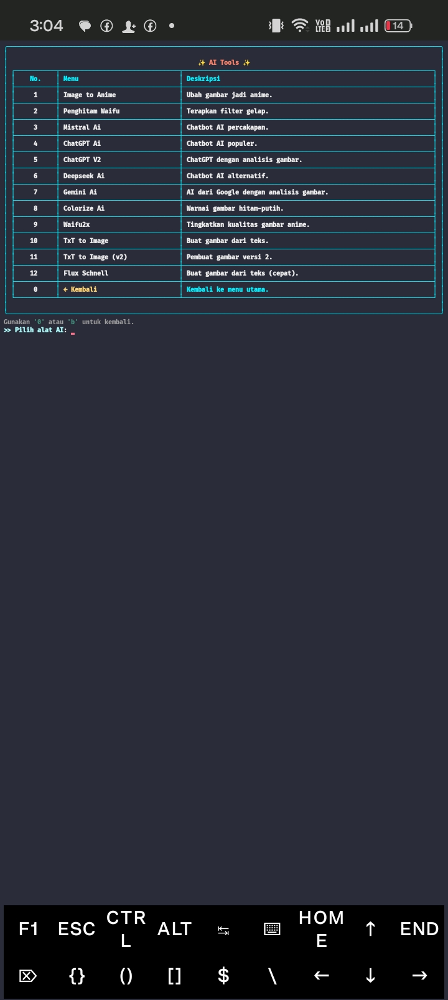
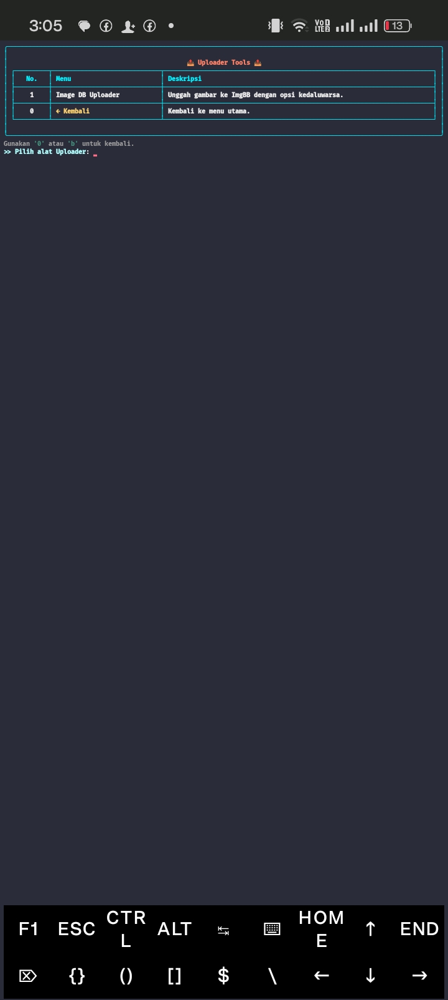
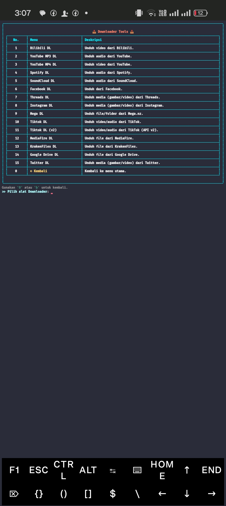
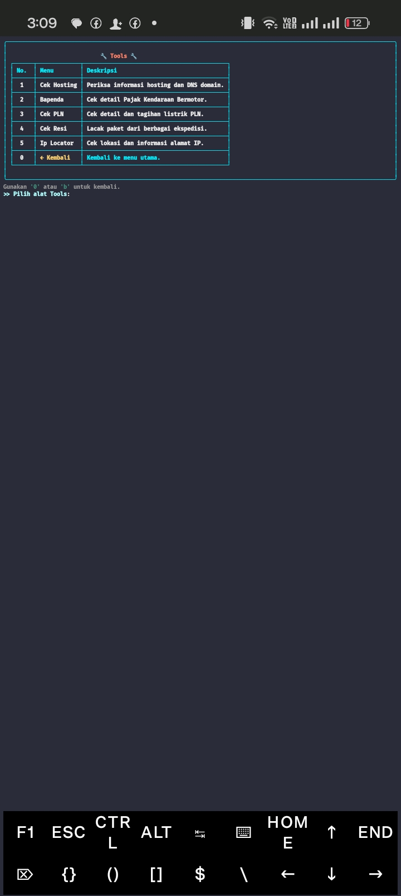
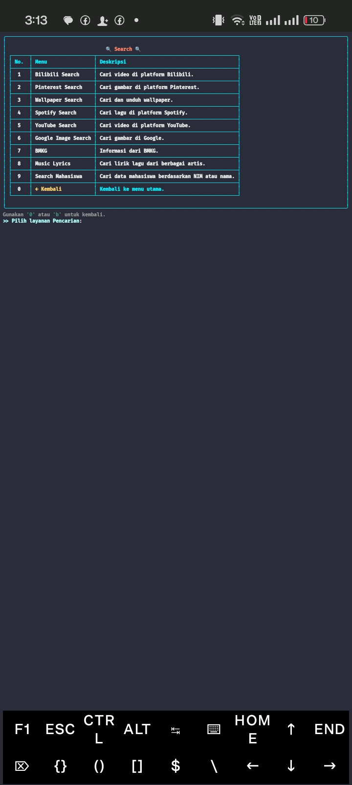

# MasterTools

MasterTools adalah aplikasi berbasis terminal yang menyediakan berbagai fitur berguna seperti AI, pengunggahan file, pengunduhan video, utilitas, dan pencarian. Aplikasi ini dibangun dengan Python dan menggunakan library Rich untuk tampilan antarmuka yang menarik di konsol.

## Fitur

- **AI** 🤖: Akses ke berbagai kecerdasan buatan, chat, dan generator gambar.
- **Uploader** 📤: Unggah file ke berbagai hosting dengan mudah.
- **Downloader** 📥: Unduh video dari berbagai platform (YouTube, dll).
- **Tools** 🔧: Koleksi utilitas dan alat bantu berguna.
- **Search** 🔍: Pencarian cepat dan efisien.

## Screenshots

Berikut adalah tampilan antarmuka dari setiap fitur yang tersedia di MasterTools:

<table>
<tr>
<td align="center"><br><b>Tampilan Menu Utama</b></td>
<td align="center"><br><b>Tampilan Menu AI</b></td>
</tr>
<tr>
<td align="center"><br><b>Tampilan Menu Uploader</b></td>
<td align="center"><br><b>Tampilan Menu Downloader</b></td>
</tr>
<tr>
<td align="center"><br><b>Tampilan Menu Tools</b></td>
<td align="center"><br><b>Tampilan Menu Search</b></td>
</tr>
</table>
## Instalasi di Termux

1.  Buka Termux di perangkat Android Anda.
2.  Jalankan perintah berikut untuk menginstal MasterTools secara otomatis:

    ```bash
    pkg update && pkg upgrade -y && pkg install git python -y && git clone https://github.com/bdmasumvai/MasterTools.git && cd MasterTools && pip install -r requirements.txt && python main.py
    ```

    Perintah ini akan:

    - Memperbarui dan meng-upgrade paket Termux.
    - Menginstal Git dan Python.
    - Meng-clone repositori MasterTools.
    - Menginstal semua dependensi yang diperlukan.
    - Menjalankan aplikasi.

## Cara Penggunaan

Setelah instalasi selesai, Anda akan melihat menu utama dengan 5 opsi:

1.  **AI** 🤖: Kecerdasan buatan, Chat, Image Gen.

    - Pilih opsi ini untuk mengakses fitur AI.
    - Ikuti petunjuk di layar untuk menggunakan berbagai fitur AI.

2.  **Uploader** 📤: Unggah file ke berbagai host.

    - Pilih opsi ini untuk mengunggah file.
    - Ikuti petunjuk untuk memilih file dan host tujuan.

3.  **Downloader** 📥: Unduh video dari berbagai platform.

    - Pilih opsi ini untuk mengunduh video.
    - Masukkan URL video dan pilih kualitas yang diinginkan.
    - Gunakan fitur _pagination_ untuk menavigasi hasil pencarian yang banyak.

4.  **Tools** 🔧: Utilitas dan alat bantu.

    - Pilih opsi ini untuk mengakses berbagai utilitas.
    - Pilih alat yang sesuai dengan kebutuhan Anda.

5.  **Search** 🔍: Cari konten di berbagai platform.
    - Pilih opsi ini untuk melakukan pencarian.
    - Masukkan kata kunci pencarian.
    - Gunakan fitur _pagination_ untuk menavigasi hasil pencarian yang banyak.

## Navigasi

- Gunakan angka untuk memilih menu.
- Gunakan tombol `0` atau `q` untuk keluar dari aplikasi.
- Saat di dalam menu, ikuti petunjuk yang tersedia untuk navigasi lebih lanjut.
- Untuk hasil pencarian atau daftar video yang panjang, gunakan:
  - `P` untuk halaman sebelumnya.
  - `N` untuk halaman berikutnya.
  - `G` untuk langsung pergi ke halaman tertentu.

## Konfigurasi

Aplikasi menggunakan file konfigurasi untuk menyimpan pengaturan. Anda dapat mengedit file konfigurasi untuk menyesuaikan pengalaman pengguna.

## Kontribusi

Kontribusi sangat diterima! Jika Anda menemukan bug atau memiliki saran untuk fitur baru, silakan buat _issue_ atau _pull request_ di repositori GitHub.

## Lisensi

Proyek ini dilisensikan di bawah Lisensi MIT. Lihat file [LICENSE](https://raw.githubusercontent.com/bdmasumvai/MasterTools/refs/heads/main/LICENSE) untuk detail lebih lanjut.

## Author

**bdmasumvai** - [GitHub](https://github.com/bdmasumvai/MasterTools)

---

_Terima kasih telah menggunakan MasterTools!_
